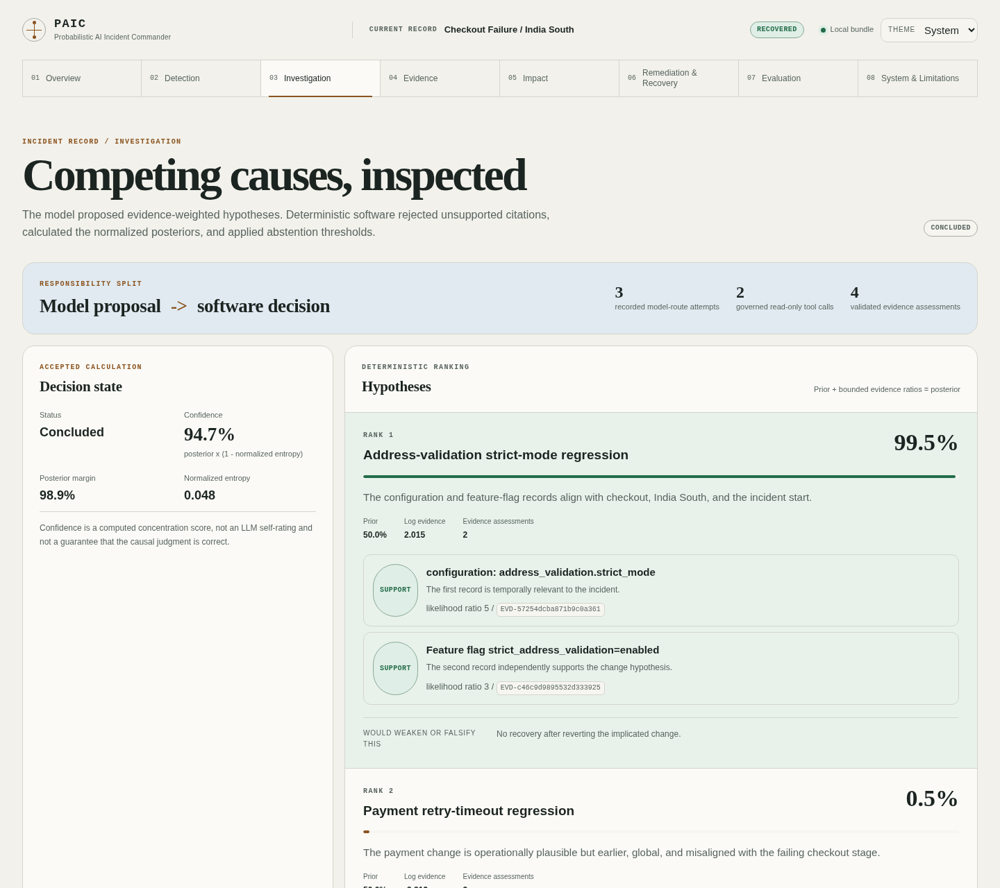
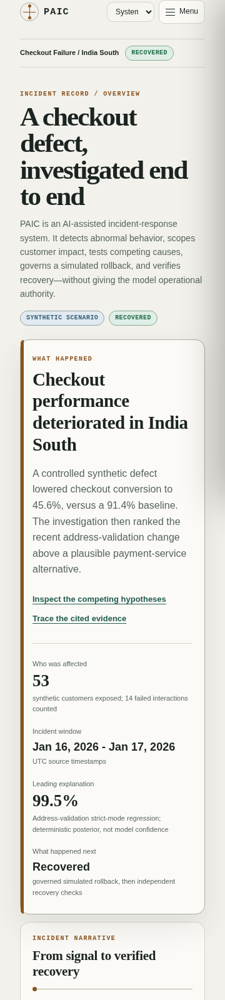

# Probabilistic AI Incident Commander

**AI-assisted incident investigation with source-bound evidence, deterministic safety policy, and independent recovery verification.**

[**Live Demo →**](https://kabbersokhi-boop.github.io/probabilistic-ai-incident-commander/) · [Architecture](docs/ARCHITECTURE.md) · [Security model](docs/SECURITY_MODEL.md) · [Evaluation](docs/EVALUATION.md)


PAIC answers a practical incident-response question: when a business metric suddenly collapses, how can an AI help investigate without being allowed to invent facts, approve its own action, or declare that its action worked?

In the public demo, checkout conversion falls in **India South** after an **address-validation strict-mode rollout**. PAIC detects the abnormal behavior, scopes the affected synthetic customers, compares that rollout with a plausible payment-service alternative, ranks both explanations, records a governed simulated rollback, and verifies recovery from later measurements.

## What problem does this solve?

Imagine an e-commerce company sees checkout conversion suddenly fall. Was it the checkout deployment, the payment processor, inventory, a feature flag, bad analytical data, or ordinary variance?

The evidence is usually split across telemetry, deploy logs, configuration history, service ownership, runbooks, customer-impact data, and prior incidents. Responders must work quickly, but a confident AI narrative is dangerous if it can cite facts it never observed or turn a guess into operational authority.

PAIC turns that investigation into an auditable pipeline:

```text
abnormal metric
      ↓
affected customers and funnel stage
      ↓
source-bound operational evidence
      ↓
competing hypotheses + explicit falsifiers
      ↓
deterministically calculated posterior or abstention
      ↓
policy + exact approvals + simulated reversible action
      ↓
later primary and guardrail measurements
      ↓
independent recovery decision
```

## What happens in this demo?

The controlled reference scenario represents a synthetic Indian marketplace between 16–17 January 2026.

1. A known detector perturbation lowers India South checkout conversion to **45.6%**, against a **91.4%** baseline and an **88.0–94.8%** expected range. Four statistical signals support the anomaly after history, sample-size, effect-size, and false-discovery gates pass.
2. The impact artifact counts **53 exposed synthetic customers** and **14 failed checkout interactions** in the incident slice. Churn and financial consequences are labeled as modeled benchmark estimates, not accounting facts.
3. Operational evidence contains two competing changes: regional address-validation strict mode was enabled 20 minutes before the incident; a global payment retry-timeout change occurred six hours earlier.
4. A credential-free scripted provider proposes both hypotheses, citations, priors, likelihood ratios, falsifiers, and unknowns.
5. Deterministic code accepts only evidence returned by successful governed tool calls, bounds the proposed weights, and calculates posteriors of **99.47%** for address validation and **0.53%** for the payment alternative.
6. Policy records a high-risk simulated rollback only after two distinct approval groups satisfy exact-plan checks. The local synthetic resource moves from a known bad revision to its prior revision.
7. Execution is not treated as recovery. Four later observations across checkout conversion and the payment-approval guardrail pass equivalence, trend, sample, and sustain criteria before software records the incident as recovered.

That 99.47% is a deterministic posterior for one scripted synthetic investigation. It is not “the AI is 99.47% sure,” and it is not a real-world root-cause accuracy claim.



## What the AI does

With a live OpenAI-compatible provider, the model may:

- choose one approved read-only investigation tool per round;
- search changes, anomalies, impact, lineage, runbooks, history, and registered in-memory tables;
- propose multiple hypotheses with priors, bounded likelihood ratios, supporting and contradicting evidence, unknowns, and falsifiers;
- recommend the next read-only check or submit a structured proposal.

The public site is rebuilt without credentials and uses committed scripted provider responses. It validates the system architecture and control path; it does **not** demonstrate live-model performance.

## What deterministic software controls

Ordinary code—not the model—owns:

- synthetic generation, metric construction, anomaly detection, and impact estimation;
- tool authorization, SELECT-only SQL parsing, source binding, limits, and audit receipts;
- citation validity, likelihood-ratio bounds, posterior normalization, entropy, and abstention;
- remediation risk, approval identity and separation, replay protection, and simulated execution;
- statistical recovery, lifecycle reopening, hidden-answer scoring, calibration, and safety evaluation;
- public-bundle validation, sanitization, checksums, and browser source identity.

The model cannot create a valid citation, set its accepted probability, grant approval, execute arbitrary infrastructure changes, decide recovery, read evaluator answer keys, or add browser authority.

## Where the data comes from

PAIC generates a reproducible synthetic commerce environment: customers, sellers, products, warehouses, checkout sessions, payments, orders, inventory, deliveries, returns, deployments, feature flags, service health, and data-pipeline records across four Indian regions.

The public scenario uses four explicitly different kinds of source data:

- **generated baseline records** for normal synthetic commerce behavior;
- **a known detector perturbation** applied to a metric copy so anomaly truth is measurable;
- **configured operational context** for changes, flags, runbooks, lineage, and historical incidents;
- **benchmark impact and post-action observations** for estimators and recovery controls.

These stages share the same incident identity, region, window, and source dataset, but the repository does not claim that one defect is injected through every raw event and automatically causes every downstream artifact. That remains an honest reference-implementation limitation.

### Why synthetic data?

Synthetic data provides known truth, deterministic replay, privacy-safe demonstrations, adversarial fixtures, and measurable abstention/calibration behavior. A polished answer without known truth cannot show whether the investigation was correct or merely persuasive.

## Explore the live demo

[Open the verified public dashboard](https://kabbersokhi-boop.github.io/probabilistic-ai-incident-commander/) and follow this route:

| View | Human question it answers |
|---|---|
| **Overview** | What is PAIC, what happened, who was affected, what did it conclude, and what happened next? |
| **Detection** | How do we know checkout behavior was abnormal? |
| **Investigation** | Which causes competed, which evidence moved them, and who calculated the probability? |
| **Evidence** | What operational facts did the investigation actually observe? |
| **Impact** | Who was affected, what was directly counted, and what was estimated? |
| **Remediation & Recovery** | What did policy allow, what simulated action occurred, and how was recovery proven? |
| **Evaluation** | Why trust the control path rather than a convincing AI answer? |
| **System & Limitations** | What may the model, deterministic runtime, and browser each do? |

The frontend is a static, read-only report. It has no backend, accounts, analytics, credentials, arbitrary URLs, approval controls, rollback controls, or mutation API.



## Real-world use case

The same investigation pattern appears across industries:

- **E-commerce:** checkout conversion drops after a regional release.
- **SaaS:** one API’s latency and error rate rise after a deployment.
- **Fintech:** payment approvals fall for one issuer or route.
- **Marketplace:** orders fail in one region while global service health looks normal.

In a company, PAIC could help an incident responder combine read-only telemetry, deployments, configuration changes, service health, customer impact, historical incidents, and runbooks into competing, evidence-based hypotheses.

This repository is a controlled reference implementation. It cannot ingest arbitrary company systems without integration work, and it is not a production incident-management service.

### Using your own data

A responsible adoption path is deliberately gradual:

1. **Historical replay:** map a closed set of past incident exports into the validated artifact contracts and compare results with known outcomes.
2. **Read-only adapters:** replace synthetic sources with narrowly scoped adapters for telemetry, deploy/configuration history, service catalogs, incident records, and runbooks.
3. **Shadow mode:** run investigations beside human responders with no operational authority; measure citation quality, abstention, latency, and calibration.
4. **Human-reviewed decision support:** expose proposals and evidence to responders while approvals and actions remain in existing company systems.
5. **Narrow governed actions:** only after evidence, evaluation, security, identity, and rollback controls are proven should a company consider a small allowlist of reversible actions.

An adapter should publish the same validated, hash-bound artifact shape used by the synthetic sources. The governed gateway then reads registered projections; it does not hand general production credentials to the model.

## Why this is not just an LLM wrapper

- **Evidence is a data product.** Each stage has a schema, manifest, lineage, checksums, and closed-world validation.
- **Uncertainty is executable.** The model proposes weights; code validates citations, computes normalized posteriors, measures entropy, and may abstain.
- **Authority is explicit.** Read-only investigation and simulated remediation use separate deny-by-default paths.
- **Execution and recovery are different facts.** A receipt proves a local state transition; only later measurements can prove recovery.
- **The evaluator is independent.** Visible prompts and hidden answers live in separate roots, with deterministic replay and adversarial boundary cases.
- **The public site is source-bound.** Every incident value comes from the validated bundle or a bounded selector; malformed bundles fail closed.

## Architecture

```text
OPTIONAL MODEL                    DETERMINISTIC RUNTIME
structured tool choices ───────► governed read-only gateway
hypotheses + evidence weights     source binding + audit receipts
              │                              │
              └──────────────► citation validation
                                probability + abstention
                                policy + exact approvals
                                simulated atomic transition
                                statistical recovery
                                hidden-answer evaluation
                                           │
                                           ▼
                                sanitized hash-bound bundle
                                           │
                                           ▼
                                static read-only React report
```

See [Architecture](docs/ARCHITECTURE.md), [governed tools](docs/GOVERNED_TOOL_GATEWAY.md), [probabilistic investigation](docs/PROBABILISTIC_AGENTIC_INVESTIGATION.md), [controlled remediation](docs/CONTROLLED_REMEDIATION.md), and [recovery verification](docs/RECOVERY_VERIFICATION.md).

## Evaluation credibility

The public dashboard shows a **three-case scripted smoke fixture**. Its percentages test evaluator integrity, abstention, citation handling, and authority controls; they do not establish general incident-diagnosis accuracy or live-model quality.

The repository also contains a separate 15-case standard offline benchmark, no-lineage ablation, paired bootstrap comparison, 12 adversarial boundary cases, and a 10-scenario detector benchmark. These are synthetic engineering tests, not production performance claims. Likelihood ratios in the investigation are model-proposed, bounded inputs—not empirically learned real-world calibration weights.

## Security and delivery

The model has no unrestricted filesystem, network, shell, database, cloud, deployment, approval, recovery, or evaluator capability. Investigative SQL is AST-parsed SELECT-only over registered in-memory tables. Remediation is limited to validated local simulated state and requires exact-plan, identity-bound approvals.

CI checks Python 3.11/3.12, schemas, artifact replay, branch coverage, formatting, typing, web unit/browser/axe tests, responsive visual baselines, bundle size, secret/path scans, container hardening, vulnerability policy, exact-head readiness, resilience, and authoritative soak behavior.

See the [security model](docs/SECURITY_MODEL.md), [vulnerability policy](docs/VULNERABILITY_POLICY.md), [container controls](docs/CONTAINERS.md), and [quality gates](docs/QUALITY_GATES.md).

## Run locally

Requirements: Git, Python 3.11 or 3.12, and Node.js 22.22.2 or newer.

```bash
git clone https://github.com/kabbersokhi-boop/probabilistic-ai-incident-commander.git
cd probabilistic-ai-incident-commander

python -m venv .venv
source .venv/bin/activate
python -m pip install --require-hashes -r requirements-dev.lock
python -m pip install --no-deps --no-build-isolation -e .

make web-bundle web-validate
cd web
npm ci
npm run build
npm run preview
```

Open the URL printed by Vite, normally `http://localhost:4173/`. The credential-free build does not contact an external model provider.

For the complete repository validation path, run `make verify`. See [development and quality gates](docs/QUALITY_GATES.md) for targeted commands.

## Repository map

```text
src/paic/simulator/       Synthetic commerce generation and validation
src/paic/analytics/       Metrics, cohorts, funnels, contribution, quality
src/paic/detection/       Statistical detection and known perturbations
src/paic/impact/          Exposure, causal diagnostics, churn, financial impact
src/paic/evidence/        Changes, health, lineage, runbooks, timelines
src/paic/tools/           Read-only policy, SQL, source binding, audit ledger
src/paic/investigation/   Providers, orchestration, probability, abstention
src/paic/remediation/     Policy, approvals, replay protection, local execution
src/paic/recovery/        Recovery tests and lifecycle reopening
src/paic/evaluation/      Hidden answers, scoring, ablations, attacks
src/paic/web_readiness.py Sanitized deterministic public-bundle exporter
web/                      Static React/TypeScript dashboard
configs/                  Reproducible runtime and benchmark profiles
schemas/                  Generated public contracts
tests/                    Unit, integration, integrity, and adversarial tests
```

## Honest limitations

- All public data and actions are synthetic; nothing here demonstrates production readiness.
- The public investigation uses committed scripted responses, not a live LLM.
- The scenario aligns detection, impact, evidence, investigation, remediation, and recovery around one incident contract, but does not propagate one injected defect through every raw event.
- Proposed likelihood ratios are bounded but not historically learned or calibrated on company incidents.
- Impact adjustment covers observed synthetic covariates and is not a business forecast.
- Approval keys and atomic state guarantees are local reference mechanisms, not enterprise SSO, KMS, or distributed transactions.
- GitHub Pages cannot supply all headers in the deployment policy.

Licensed under the [MIT License](LICENSE).
