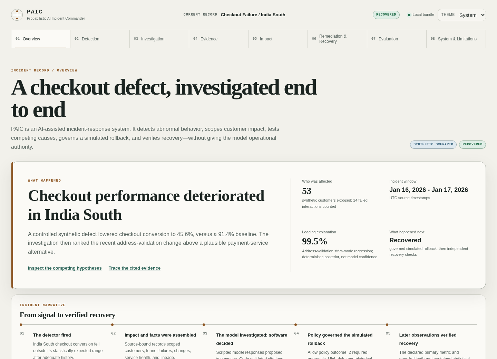
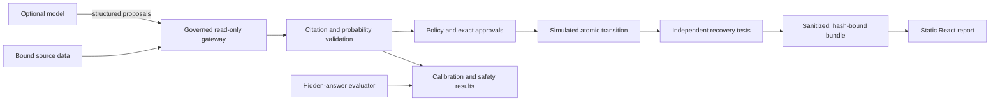

# Probabilistic AI Incident Commander

**Evidence-grounded incident investigation in which models propose and deterministic software
controls evidence, probability, approvals, execution, recovery, and evaluation.**

[](https://github.com/kabbersokhi-boop/probabilistic-ai-incident-commander/actions/workflows/ci.yml)
[](https://github.com/kabbersokhi-boop/probabilistic-ai-incident-commander/actions/workflows/web-quality.yml)
[](pyproject.toml)
[](LICENSE)

[**Explore the live incident →**](https://kabbersokhi-boop.github.io/probabilistic-ai-incident-commander/)
· [Architecture](docs/ARCHITECTURE.md)
· [Security model](docs/SECURITY_MODEL.md)
· [Evaluation](docs/EVALUATION.md)



## What it demonstrates

The reference scenario models a checkout-conversion collapse in a synthetic Indian marketplace.
The system detects the anomaly, scopes affected customers, gathers operational evidence, compares
an address-validation rollout with a plausible payment-service alternative, and calculates a
posterior for each hypothesis. It then records a governed simulated rollback and verifies recovery
from later primary and guardrail measurements.

The central design constraint is authority separation:

- the model can select approved read-only tools and propose structured hypotheses;
- deterministic code validates citations and calculates accepted probabilities;
- policy and two distinct approval groups control the exact remediation plan;
- execution changes only a local synthetic resource;
- later measurements, not the model or execution receipt, decide recovery.

The public dashboard uses committed scripted provider responses and requires no credential. It
proves the system path and browser artifact contract. It does not measure live-model quality.

## Investigation pipeline

```text
abnormal metric
    -> affected cohort and funnel stage
    -> source-bound evidence and competing hypotheses
    -> deterministic posterior or abstention
    -> policy, exact approvals, and simulated action
    -> later primary and guardrail measurements
    -> independent recovery decision
```

## Model and software responsibilities

| Model can propose | Deterministic software controls |
| --- | --- |
| One approved read-only tool call per round | Tool authorization, SELECT-only SQL, limits, and audit receipts |
| Hypotheses, priors, and bounded likelihood ratios | Citation validity, posterior normalization, entropy, and abstention |
| Supporting and contradicting evidence | Remediation risk, identity separation, exact-plan approval, and replay protection |
| Unknowns, falsifiers, and the next check | Simulated transition, recovery statistics, lifecycle reopening, and evaluation |

The model cannot create a valid citation, directly set its accepted probability, approve or
execute a change, read evaluator answer keys, or declare recovery.

## Architecture



Source data, model output, policy decisions, action receipts, and recovery measurements retain
separate identities. The browser receives only a validated, sanitized, checksum-bound bundle.

## Evidence and evaluation

The repository includes:

- a reproducible synthetic commerce environment across four regions;
- statistical anomaly gates for history, sample size, effect size, and false discovery;
- a 15-case offline investigation benchmark and no-lineage ablation;
- paired bootstrap comparison and multiclass Brier scoring;
- 12 adversarial authority and artifact-boundary cases;
- a 10-scenario detector benchmark;
- unit, integration, browser, accessibility, responsive-visual, container, and resilience checks.

These are synthetic engineering tests. They do not establish production diagnosis accuracy. Model-
proposed likelihood ratios are bounded inputs; they are not learned calibration weights. See the
[evaluation contract](docs/EVALUATION_CONTRACT.md) for the exact scoring rules.

## Run locally

Requirements: Git, Python 3.11 or 3.12, and Node.js 22.22.2 or newer.

```bash
git clone https://github.com/kabbersokhi-boop/probabilistic-ai-incident-commander.git
cd probabilistic-ai-incident-commander

python -m venv .venv
source .venv/bin/activate
python -m pip install --require-hashes -r requirements-dev.lock
python -m pip install --no-deps --no-build-isolation -e .

make web-bundle web-validate
cd web
npm ci
npm run build
npm run preview
```

Open the URL printed by Vite, normally `http://localhost:4173/`. The credential-free build does
not contact an external provider. Run `make verify` for the complete repository validation path.

## Code tour

| Area | Path |
| --- | --- |
| Synthetic commerce and analytics | [`src/paic/simulator/`](src/paic/simulator/), [`src/paic/analytics/`](src/paic/analytics/) |
| Detection and impact | [`src/paic/detection/`](src/paic/detection/), [`src/paic/impact/`](src/paic/impact/) |
| Evidence and governed tools | [`src/paic/evidence/`](src/paic/evidence/), [`src/paic/tools/`](src/paic/tools/) |
| Investigation and probability | [`src/paic/investigation/`](src/paic/investigation/) |
| Remediation and recovery | [`src/paic/remediation/`](src/paic/remediation/), [`src/paic/recovery/`](src/paic/recovery/) |
| Independent evaluation | [`src/paic/evaluation/`](src/paic/evaluation/) |
| Public artifact contract | [`src/paic/web_readiness.py`](src/paic/web_readiness.py), [`schemas/`](schemas/) |
| Static dashboard | [`web/`](web/) |

## Scope

All public records and actions are synthetic. Nothing here proves production readiness. The local
approval keys and atomic state transition are reference mechanisms, not enterprise identity, KMS,
or a distributed transaction. Impact adjustment covers observed synthetic covariates and is not a
business forecast. GitHub Pages cannot supply every header in the deployment policy.

Read [Security](SECURITY.md), the [security model](docs/SECURITY_MODEL.md), and the
[quality gates](docs/QUALITY_GATES.md) before adapting the system.

Licensed under the [MIT License](LICENSE).
