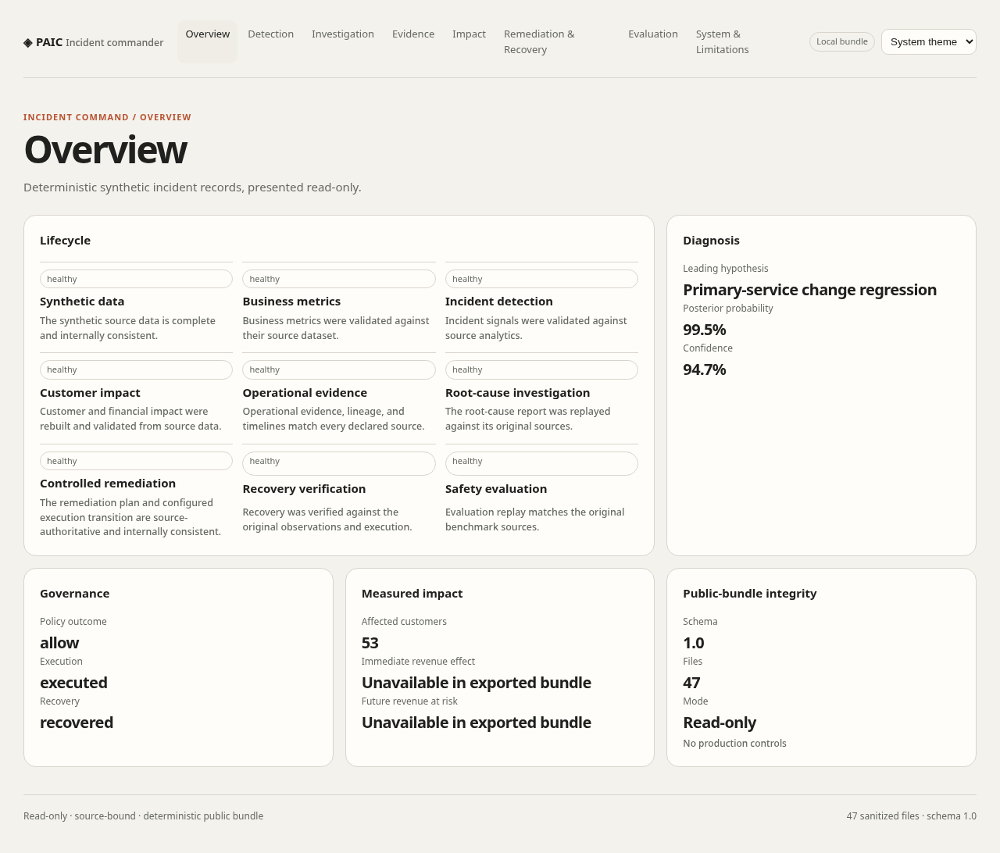

# Probabilistic AI Incident Commander

**Evidence-grounded AI for investigating operational incidents under uncertainty — without giving the model uncontrolled production authority.**

[](https://github.com/kabbersokhi-boop/probabilistic-ai-incident-commander/actions/workflows/ci.yml)

> **Public reference / portfolio project.** PAIC operates on deterministic synthetic commerce data and simulated remediations. It does not control a real production environment and does not make production-performance claims.



## The problem

Imagine an e-commerce company suddenly sees checkout conversion fall.

The on-call team needs to answer several questions quickly:

- Is this a real incident or normal statistical variation?
- Which customers, regions, devices, funnel stages, or services are affected?
- What changed immediately before the degradation?
- Which explanation best fits the evidence — checkout, payments, inventory, data quality, or something else?
- How much customer and financial impact is there?
- What remediation is permitted?
- Did the system actually recover after the intervention?

**Probabilistic AI Incident Commander (PAIC)** is an end-to-end reference implementation for that workflow.

It combines deterministic analytics, statistical anomaly detection, source-bound operational evidence, bounded AI investigation, probabilistic root-cause ranking, governed simulated remediation, recovery verification, and reproducible evaluation.

The goal is not to build another chatbot. The project explores a harder engineering question:

> **How do you let AI reason about a serious operational incident while keeping evidence, probability, security, and authority under deterministic control?**

## The demo incident

The repository contains a deterministic synthetic commerce environment representing an online marketplace.

The public demonstration follows a controlled checkout incident in which stricter address validation is enabled for **India South** shortly before checkout performance deteriorates. Other operational changes also exist around the incident window, including a payment-service change that can initially look suspicious.

The investigator therefore has to do more than notice a bad metric. It must gather evidence, compare competing hypotheses, search for contradictory observations, rank likely causes, and preserve an auditable chain from source data to conclusion.

The current synthetic scenario ultimately favors a checkout-service change regression as the leading explanation, but that conclusion is produced from the governed incident artifacts rather than hard-coded into the browser.

## How it works

```text
Synthetic commerce activity
          |
          v
Deterministic analytics
          |
          v
Statistical anomaly detection
          |
          v
Customer + financial impact analysis
          |
          v
Operational evidence and lineage
          |
          v
Bounded AI investigation
          |
          v
Competing hypotheses + posterior probabilities
          |
          v
Deterministic policy / approval boundary
          |
          v
Simulated remediation
          |
          v
Statistical recovery verification
          |
          v
Evaluation against known ground truth
          |
          v
Read-only public incident dashboard
```

### 1. Detect

Statistical detectors decide whether observed behavior is actually unusual. The language model is not asked to look at a chart and decide whether something merely "looks anomalous."

### 2. Scope

The analytics layer determines where the problem is concentrated across regions, devices, customer cohorts, funnel stages, services, and operational changes.

### 3. Gather evidence

The investigator can use a governed, read-only tool layer for approved operations such as anomaly lookup, evidence search, change inspection, lineage tracing, historical-incident search, impact summaries, runbook retrieval, and bounded SQL queries.

### 4. Investigate competing hypotheses

The system maintains multiple candidate explanations instead of immediately anchoring on one cause. Hypotheses can carry expected observations, supporting evidence, contradictory evidence, falsifiers, and probability updates.

### 5. Rank likely causes

Posterior probabilities are calculated outside the language model. The model may help reason over evidence, but it does not get to invent its own confidence score or bypass the evidence model.

### 6. Govern remediation

Potential remediation is evaluated by deterministic policy. Sensitive actions require exact approval and state binding. The demonstration performs only simulated, reversible remediation.

### 7. Verify recovery

A successful command is not treated as proof of recovery. Subsequent observations and guardrail metrics must support the recovery decision, and the lifecycle can reopen when regression is detected.

### 8. Evaluate

Because the scenarios are synthetic, the project can compare predictions against known hidden ground truth. Evaluation is therefore reproducible rather than based on whether a demo explanation sounds convincing.

## What the public dashboard shows

The React/TypeScript dashboard is a **read-only presentation layer over a validated deterministic public bundle**.

It contains eight views:

1. **Overview** — lifecycle, diagnosis, governance, impact, and bundle integrity
2. **Detection** — anomaly and change-point evidence
3. **Investigation** — competing hypotheses and posterior probabilities
4. **Evidence** — source-bound operational timeline
5. **Impact** — affected customers and cohort analysis
6. **Remediation & Recovery** — historical governed remediation and recovery records
7. **Evaluation** — benchmark and safety results
8. **System & Limitations** — architecture, source identity, and authority boundaries

The browser cannot execute remediation, approve actions, access production credentials, run unrestricted SQL, execute shell commands, control recovery state, or override evaluator results. Missing information is rendered as unavailable instead of being fabricated.

## Where the data comes from

PAIC includes its own deterministic commerce simulator.

The impact demonstration generates **40 days of synthetic activity** for an environment with **400 customers, 12 sellers, 120 products, 4 warehouses, and 6 promotions**. It models four Indian regions, Android/iOS/web clients, acquisition channels, payment methods, fake issuers and carriers, and backend services such as checkout, payments, inventory, fulfilment, seller feeds, and returns.

A fixed random seed makes the scenario reproducible. The same code and configuration regenerate the same synthetic world, which supports deterministic replay, regression testing, and hidden-ground-truth evaluation.

**No customer or company data in the demo represents a real person or production business.**

## Why this project is different from a typical AI demo

Many AI demonstrations reduce to:

```text
Prompt -> LLM -> Answer
```

PAIC deliberately separates reasoning from authority.

- **Statistics detect anomalies.** A language model does not decide whether a metric moved abnormally.
- **Evidence precedes conclusions.** Hypotheses reference source-bound records and can contain contradictory observations.
- **Probability is explicit.** Root-cause confidence comes from deterministic posterior calculations rather than model-generated confidence language.
- **Authority stays outside the model.** Permissions, SQL restrictions, approvals, remediation rules, recovery state, and evaluation remain ordinary deterministic software.
- **Recovery must be proven.** "Execution succeeded" is not treated as evidence that the business recovered.
- **Evaluation uses hidden answers.** Synthetic scenarios provide known ground truth for reproducible scoring.

## Engineering highlights

### Applied AI

- bounded agentic investigation;
- competing-hypothesis reasoning;
- evidence-grounded tool use;
- provider-neutral model integration;
- deterministic posterior ranking;
- prompt-injection and fabricated-evidence defenses.

### Data and statistics

- deterministic synthetic commerce generation;
- funnel, cohort, and contribution analytics;
- statistical anomaly and change detection;
- customer-impact, churn, causal, and financial-risk analysis;
- recovery verification;
- hidden-ground-truth evaluation.

### Safety and governance

- deny-by-default read-only tool gateway;
- parsed SQL policy;
- hash-chained audit records;
- exact approval binding and replay protection;
- deterministic remediation authority;
- deterministic recovery and evaluator authority;
- explicit browser authority boundaries.

### Production engineering

- Python 3.11 / 3.12 validation;
- deterministic dependency locks;
- hardened non-root containers;
- digest-pinned base images;
- vulnerability policy and retained scan evidence;
- CycloneDX supply-chain evidence;
- exact-commit artifact binding;
- backup/restore and rollback validation;
- resilience and authoritative soak testing;
- GitHub Actions CI.

### Frontend

- React 19 + TypeScript;
- Vite static build;
- responsive desktop/mobile interface;
- system/light/dark themes;
- keyboard navigation and semantic accessibility;
- reduced-motion support;
- Playwright browser and visual-regression testing;
- automated accessibility checks.

## Example benchmark results

The standard deterministic detector benchmark currently reports:

| Measure | Result |
|---|---:|
| Injected scenarios | 10 |
| Scenario recall | 100% |
| Observation precision | 81.25% |
| False-positive rate | 0.24% |
| Mean detection delay | 1.2 periods |

These are **synthetic evaluator results** intended to demonstrate reproducibility and evaluation methodology. They are not claims about production performance.

## Run the dashboard locally

### Requirements

- Python 3.11+
- Node.js 22+
- npm
- Git

Clone the repository:

```bash
git clone https://github.com/kabbersokhi-boop/probabilistic-ai-incident-commander.git
cd probabilistic-ai-incident-commander
```

Create and activate a Python environment:

```bash
python -m venv .venv
source .venv/bin/activate
```

Install the locked Python dependencies:

```bash
python -m pip install --require-hashes -r requirements-dev.lock
python -m pip install --no-deps --no-build-isolation -e .
```

Generate the deterministic public incident bundle:

```bash
.venv/bin/python -m paic.web_readiness build \
  --workspace configs/tui/smoke.yaml \
  --output-dir .artifacts/web-bundle
```

Build and start the frontend:

```bash
cd web
npm ci
npm run build
npm run preview
```

Open the local URL printed by Vite, normally:

```text
http://localhost:4173/
```

For the full product and deployment notes, see [`docs/WEB_PRODUCT.md`](docs/WEB_PRODUCT.md). For a guided walkthrough, see [`docs/WEB_DEMO_SCRIPT.md`](docs/WEB_DEMO_SCRIPT.md).

## Suggested demo walkthrough

If you are reviewing the project for the first time, navigate in this order:

```text
Overview
   |
Detection
   |
Investigation
   |
Evidence
   |
Impact
   |
Remediation & Recovery
   |
Evaluation
   |
System & Limitations
```

Try to answer five questions while navigating:

1. What happened?
2. What evidence shows the behavior was abnormal?
3. Why does the system favor one root cause over the alternatives?
4. Who was affected, what remediation occurred, and was recovery verified?
5. What prevents the AI or browser from exceeding its authority?

## Security and authority model

The central architecture rule is that **reasoning capability and operational authority are separate concerns**.

Important boundaries include:

- no unrestricted infrastructure credentials for the language model;
- no production credentials in the public browser;
- read-only investigative access;
- approved tool schemas, limits, and timeouts;
- parsed SQL policy;
- source-bound evidence and audit trails;
- exact approval checks for sensitive simulated actions;
- blocked high-risk actions;
- explicit prompt-injection defenses;
- deterministic remediation, recovery, and evaluation authority outside the model.

See [`docs/SECURITY_MODEL.md`](docs/SECURITY_MODEL.md) for the full security model.

## Quality gates

```bash
python -m ruff format --check .
python -m ruff check .
python -m mypy src tests
python -m pytest --cov=paic --cov-report=term-missing
make locks-validate locks-freshness
make web-bundle web-validate web-backup-restore
make deployment-validate deployment-rollback-smoke
```

CI also exercises deterministic evidence generation, container resilience, vulnerability and public-artifact policy, deployment/rollback policy, package builds, backup/restore, release-integrity checks, adversarial cases, browser/accessibility checks, and authoritative soak certification.

## Repository map

```text
configs/                Reproducible simulation, analytics, detection, and evaluation scenarios
specs/                  Product, incident, safety, and evaluation contracts
src/paic/contracts/     Contract models and validation
src/paic/simulator/     Synthetic commerce generation and validation
src/paic/analytics/     Metrics, cohorts, funnels, contributions, and data quality
src/paic/detection/     Statistical anomaly and change detection
src/paic/impact/        Customer and financial impact analysis
src/paic/evidence/      Operational evidence, lineage, and timelines
src/paic/tools/         Governed tools, SQL policy, and audit ledger
src/paic/investigation/ Agent orchestration, probability, and reports
src/paic/remediation/   Policy, approval, tokens, and simulated execution
src/paic/recovery/      Recovery verification and lifecycle reopening
src/paic/evaluation/    Hidden benchmarks, ablations, replay, and attacks
src/paic/tui/           Read-only terminal control room
web/                    Public React/TypeScript incident dashboard
schemas/                Generated JSON Schemas
tests/                  Unit, integrity, reliability, and adversarial tests
docs/                   Architecture, security, operations, and decisions
.github/                 CI and deployment workflows
```

## Project status

The core incident lifecycle, deterministic evaluation system, production-engineering controls, and public web interface are implemented on `main`.

The dashboard can be built and tested locally today. The GitHub Pages deployment workflow is also implemented, but this README deliberately does **not** claim a hosted public URL until repository Pages hosting has been enabled and the deployed site has been independently verified.

See [`docs/CURRENT_STATUS.md`](docs/CURRENT_STATUS.md) and [`docs/DEVELOPMENT_ROADMAP.md`](docs/DEVELOPMENT_ROADMAP.md) for detailed engineering history and current status.

## Design principle

> **AI may help reason about evidence. It should not get to redefine the evidence, invent confidence, or grant itself authority.**

That principle shapes the system from detection through investigation, remediation, recovery, and evaluation.

## Contributing

Issues and pull requests are welcome. Read [`CONTRIBUTING.md`](CONTRIBUTING.md) before proposing changes. New functionality must preserve deterministic tests, explicit contracts, measurable acceptance criteria, and the existing authority boundaries.

## License

This project is available under the [MIT License](LICENSE).
